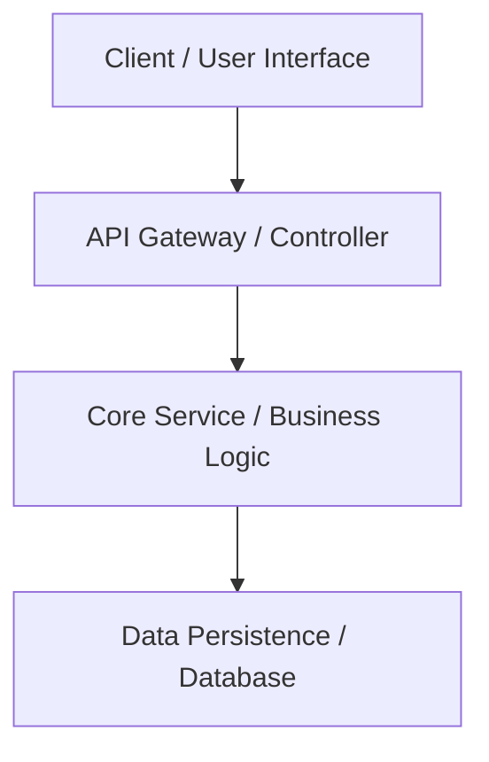

# File Justification: Architectural overview and structural blueprint template.
# System Impact of Absence: Team members and AI agents will lack visibility into high-level design, data flow, and module boundaries.

# SILVESTRIKE Portfolio OS — System Architecture

## 1. Overview & Core Mission

Brief description of SILVESTRIKE Portfolio OS, its business domain, core capabilities, and high-level architectural goals.

---

## 2. High-Level System Architecture



---

## 3. Technology Stack

- **Runtime & Language**: TypeScript
- **Frameworks**: Next.js, React
- **Data Persistence**: TBD
- **Code Intelligence**: CodeGraph AST Engine (`.codegraph/codegraph.db`)

---

## 4. Module & Directory Layout

```text
SILVESTRIKE Portfolio OS/
├── .agents/
│   └── AGENTS.md        # AI rules and governance
├── docs/
│   ├── architecture.md  # This document
│   ├── DECISIONS.md     # ADR records
│   ├── TESTING.md       # Testing strategy
│   └── plan.md          # Phased roadmap
└── README.md
```

---

## 5. Security & Invariants

1. All incoming boundaries must validate data against strict schemas.
2. Secrets must never be committed to source control or logged.
3. Errors must propagate cleanly through structured domain exceptions.
