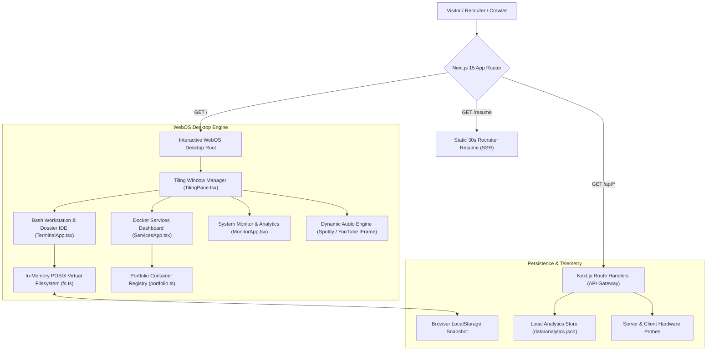

<!--
Reason for existence: System architecture documentation defining module boundaries, data flow diagrams, Dual Persona routing, and subsystem interactions.
System Impact of Absence: Autonomous agents and developers will lack clarity on system invariants, causing structural regressions and architectural decay.
-->

# SILVESTRIKE Portfolio OS — System Architecture

## 1. Overview & Dual-Persona Mission

SILVESTRIKE Portfolio OS solves a fundamental dilemma in engineering portfolios: **balancing authentic technical immersion with high-speed recruiter scannability**.

The system implements a **Dual-Persona Architecture**:
1. **Interactive Linux WebOS Mode (`/`)**: A client-side desktop environment inspired by Arch Linux and Hyprland, featuring a tiling window manager, POSIX Virtual Filesystem (VFS), Docker Container Dashboard, and CRT scanline rendering.
2. **Executive Recruiter Summary Mode (`/resume`)**: A server-side rendered (SSR) static route optimized for 30-second reviews, search engine indexing, and direct CV distribution.

---

## 2. High-Level System Architecture

---

## 3. Core Architectural Subsystems

### 3.1. Virtual Filesystem (VFS) & Shell Engine
- **In-Memory Tree**: Hierarchical `FsNode` data structure supporting `/home/silvestrike`, `/etc`, and `/bin`.
- **POSIX Operations**: Implements `resolvePath`, `findNodeByPath`, `copyNode`, `moveNode`, `deleteNode`, and `mkdir`.
- **Terminal Workstation**: Multi-session bash tabs, persistent command history, and ghost auto-suggestions.

### 3.2. Docker Container Services Registry
- **Service Modeling**: Each engineering project is represented as a first-class `ServiceUnit` container card (`image`, `status`, `ports`, `depends_on`, `environment`, `healthcheck`).
- **Pipeline Architecture Visualization**: Dynamic visual DAG rendering dependencies (e.g., `web -> api -> postgres`, `vad -> whisper -> langgraph -> groq`).
- **Verifiable Production Metrics**: Healthchecks display measured latency, test pass rates, and throughput.

### 3.3. Centralized Configuration Layer (`@/config`)
- `DEVELOPER_CONFIG`: Canonical developer identity, verified educational credentials, and contact channels.
- `SYSTEM_CONFIG`: WebOS hostname, simulated hardware specifications, and university timeline anchors.

### 3.4. Dual-Persona Recruiter Layer
- Server-side rendered static route at `/resume` with complete metadata for OpenGraph crawlers.
- 4-Sentence Project Formulation standard across all project cards (Problem -> Architecture -> Contribution -> Result).
- Universal shortcut: `Ctrl+K` Command Palette enables instant switching between Desktop and Recruiter modes.

---

## 4. Technology Stack & Invariants

| Layer | Technologies | Architectural Invariants |
|---|---|---|
| Framework & UI | Next.js 15, React 19, TailwindCSS | No third-party UI component bloat; pure CSS tokens. |
| Language & Typing | TypeScript 5 (Strict Mode) | Zero `any` types; strict boundary schemas. |
| AST Code Intelligence | CodeGraph Engine (`.codegraph/codegraph.db`) | Mandatory AST search before edits; sync after changes. |
| Window Management | Custom Drag-to-Snap Tiling Manager | Floating, tiled, and minimized states preserved. |
| Audio Subsystem | YouTube IFrame API + Fallback Watchdog | Kept in viewport DOM to avoid browser background throttling. |

---

## 5. Security & Isolation Discipline

1. **Host Isolation**: All system commands (`ps`, `kill`, `rm`) are sandboxed to the virtual browser environment. The server execution layer never executes arbitrary host process commands.
2. **Environment Variable Protection**: `.env` and sensitive credentials are never read, committed, or rendered in client components.
3. **Deterministic State**: State transitions in the window manager and VFS are explicit and recover gracefully upon page refresh.
